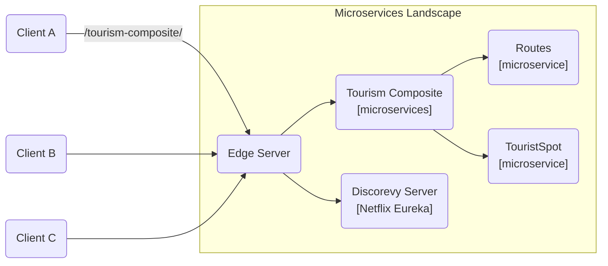

# Micro-Serviços Turismo Araras

Este projeto tem como objetivos objetivos conhecer a arquitetura de micros-serviços utilizando o ecossistema Java, 
discutir e refletir sobre esta arquitetura em relação às aplicações monolíticas tradcionais.

Inicialmente iremos construir a arquitetura com a divisão de responsabilidades da API já implementada pela equipe do PI-6.

Iremos segmentar a API em 2 principais micro-serviços:

1. Micro-serviço de pontos trísticos;
2. Micro-serviço de rotas;

> Utilizaremos microserviços auxiliares para melhor estruturação conforme forem apresentados Design Patterns para 
MicroServices em sala de aula.

## Arquitetura Inicial

Após a separação de conceitos da API, tornaremos independentes os micro-serviços de rotas e pontos e criaremos os artefatos 
de suporte para a arquitetura de micro-serviços no projeto conforme a ilustração abaixo.

> Note que para os clientes é transparente a arquitetura de micr-serviços. Estamos utilizando o Design Patter [API Gateway](https://microservices.io/patterns/apigateway.html), 
> pesquisem a respeito; o patter (Backend for Frontend) também seria uma alternativa.

### Configuração inicial dos micro-serviços

